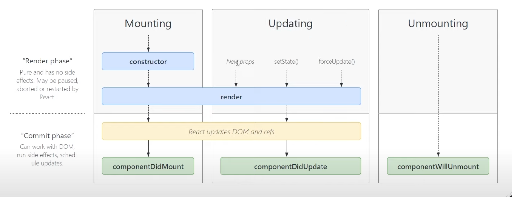

# React Component Lifecycle

The series of event that happen from Mounting of a React Component to it's Unmounting

### Mounting
- Birth of Your Component
### Update
- Growth of Your Component
### Unmounting
- Death of Your Component

## Methods in React Component Lifecycle

### render()
- render() is used to render HTML of a component in React
- This method is required for class based component to render the DOM
- It runs during Mounting & Updating of your component
- render() method should be pure i.e., You can't modify state inside it

### componentDidMount()
- It runs after the component output has been rendered in the DOM
- Commonly used while fetching the data

### componentDidUpdate()
- It invoked as soon as the updating happens (props or state changes)

### componentWillUnmount()
- This lifecycle method is called just before the component is unmount or destroyed.
- Usually used to perfom cleanUps.

## Diagram - React Component Lifecycle

Link - https://projects.wojtekmaj.pl/react-lifecycle-methods-diagram/